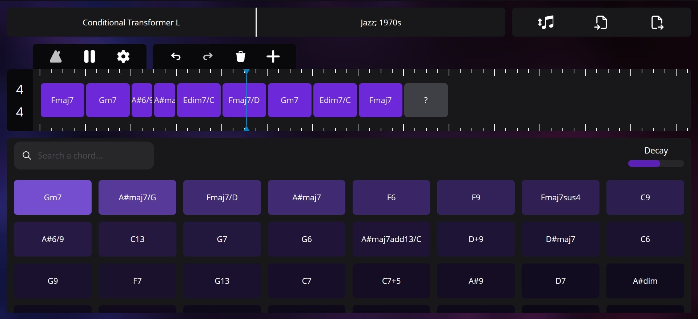

# Table of Contents

1. [Introduction](#introduction)
2. [Getting Started](#getting-started)
   - 2.1. [Prerequisites](#prerequisites)
   - 2.2. [Installation](#installation)
   - 2.3. [Running the App](#running-the-app)
3. [Support](#support)
4. [Usage](#usage)
   - 4.1. [Adding and Deleting Chords](#adding-and-deleting-chords)
   - 4.2. [Suggestions](#suggestions)
   - 4.3. [Timeline Controls](#timeline-controls)
   - 4.4. [Specifying Duration](#specifying-duration)
   - 4.5. [Customizing Signature](#customizing-signature)
   - 4.6. [Playback](#playback)
   - 4.7. [Selecting Models and Styles](#selecting-models-and-styles)
   - 4.8. [Transpose, Import, Export](#transpose-import-export)
   - 4.9. [Chord Variants](#chord-variants)
5. [FAQ](#faq)
6. [Web Stack](#web-stack)
7. [License](#license)

# ChordSeqAI Web App

## Introduction

The ChordSeqAI Web App is a dynamic and user-friendly interface for interactions with deep learning models. This Next.js application enables users to compose beautiful chord progressions by suggesting the next chord.

This app originates from the [ChordSeqAI graduate project](https://github.com/StudentTraineeCenter/chord-seq-ai), development is continued in this new repository.

## Getting Started

This section describes how to run the app locally. If you want to instead use a deployed version, visit [chordseqai.com](https://chordseqai.com).

### Prerequisites

Before you begin, ensure you have the following installed:

- [Node.js](https://nodejs.org/en)
- [git](https://git-scm.com/)

### Installation

1. Navigate to the place where you want the app to be downloaded in Command Prompt.

2. Clone the repository:
   `git clone https://github.com/PetrIvan/chord-seq-ai-app.git`
3. Navigate to the project directory:
   `cd chord-seq-ai-app`
4. Install NPM packages:
   `npm install`

### Running the App

To run the application locally:

1. Start the development server:
   `npm run dev`
2. Open http://localhost:3000 in your browser to view the app.

## Support

This app is currently supported only on desktop devices. A Chromium browser is recommended, as another alternative may not be stable.

## Usage

Keyboard shortcuts, also sometimes called hotkeys, are available for most of the functions of the app. When you hover over an element of a component, it shows you what happens on click as well as the shortcut for it. The state of the app is automatically saved locally in the browser, so you will not lose progress unless you delete the site data.

### Adding and Deleting Chords

The plus icon (shortcut `A`) above the timeline can be used to add a new chord. It is initialized as an empty chord, denoted by `?`. Clicking on it will select it and suggestions will show, selection can also be handled by the arrow keys.

The selected chord can be deleted by the delete icon (`Del`) located next to the plus icon. If you accidentally delete something, you can undo and redo the changes by the arrow icons (`Ctrl + Z`, `Ctrl + Y`).

### Suggestions

Located below the timeline. Clicking on any suggested chord will replace the selected chord with it. You can search the chords by their symbol or by the notes. If you cannot find the chord you are looking for, try enabling `Include Variants`.

### Timeline Controls

Similar to that of video editors. Scroll the mouse wheel to zoom in/out, dragging the mouse wheel will move the view. Chords cannot be shuffled around.

### Specifying Duration

You can drag the right edge of the chord to make it span a different duration. It will snap to the ticks at the top and bottom of the timeline.

### Customizing Signature

A 4/4 signature is the most common in Western music, but you may need another variant. Simply clicking on the signature will display a menu to change it to something else.

### Playback

Clicking on the play icon (`Space`) will start the playback. The blue playhead will start moving and chords playing, clicking on the icon again will pause it. You can move the playhead by clicking or dragging your mouse on the ticks, but letting the playback finish will automatically move the playhead to the start.

A metronome can be turned on (`M`) and the tempo (in beats per minute) can be specified from the icons next to the middle play icon.

### Selecting Models and Styles

The base Transformer S model may not be enough for you as you may want to also try applying some custom styles to the recommendations. Clicking on the top menu will allow you to change the model.

Recurrent Network is the simplest, fastest model, but it may not have enough capacity to suit your needs. We recommend using this model only on slower devices.

Transformer models and their S, M, and L variants (standing for small, medium, and large) are a better option. A bigger model may produce better suggestions at the cost of slower inference.

Conditional Transformer models allow you to also choose the specific genre and decade of the chord progression you are composing. A new part will show next to the name of the model, where you can select the style you are going for. Multiple genres can be selected and custom weighting can be applied to put a higher emphasis on a specific style.

### Transpose, Import, Export

The transposition is done from the left icon at the top right menu. Negative semitone values can be entered to transpose down.

You can import and export the sequence you are composing in the `.chseq` format (recommended for saving), but you can also use MIDI files. If you somehow manage to break the app by importing an invalid file, you can clear the browser site data to fix the problem (in Google Chrome under `Settings > Site Settings > View permissions and data stored across sites` find `localhost` and delete it).

### Chord Variants

Recommended for more advanced users. By opening the variant menu in the timeline for the currently selected chord (`V`) or suggestions via its button, you can specify which variant to use (usually, alternative notations or inversions). Clicking on any alternative will change the visualization on the piano. When this menu is open from the timeline, the newly selected variant can be either applied once (only to that chord) or to all (replacing all of the same chords with this variant). When it is open from the suggestions, it can be used once (replacing the selected chord with this variant) or set as default (which makes it the preferred variant in the suggestions). You can close this menu from the close icon (alternatively `Esc`).

While you might try to use variants to compose chord voicings, this is not recommended. Only use chord variants when you specifically want to use another symbol for that chord.

Scientific pitch notation, also known as American standard pitch notation, is used. Sharps are used instead of flats for note names to make the notation easier to read and understand.

For a list of all available features, check out the page [Features in the wiki](https://github.com/PetrIvan/chord-seq-ai-app/wiki/Features).

## FAQ

**Q:** How can ChordSeqAI be used for professional music production? Is attribution required for the chord progressions?

**A:** You can export the produced chord progressions as a MIDI file and use it in a different music production software (e.g. in DAWs). Everything you produce using this app is yours, therefore no attribution is needed.

**Q:** What information do the models use to produce suggestions?

**A:** The preceding chords without their variants are used. The duration of a chord is ignored for now, consecutive chords get merged.

**Q:** Is there any limit to the number of chords per sequence that can be entered?

**A:** There can be a maximum of 255 chords (after removing duplicates and empty chords) due to the restrictions of the models.

**Q:** Is AI trained on my artworks?

**A:** Your data remains private and is not used for training our AI models. All processing occurs locally in your browser.

**Q:** What kind of user data does ChordSeqAI track?

**A:** ChordSeqAI employs [Umami Analytics](https://umami.is) for basic usage statistics, focusing on privacy and anonymity. We collect minimal, anonymized data solely to enhance app functionality and user experience. No personal or detailed usage data is tracked.

## Web Stack

This is a Next.js 14 app. Tailwind CSS is used as the library for styling, Zustand serves as the state management library, ONNX runtime is employed to run the AI models, and Tone.js does the job of an audio playback library for the composed chord progressions.

## License

Distributed under the MIT License. See `LICENSE` for more information.
